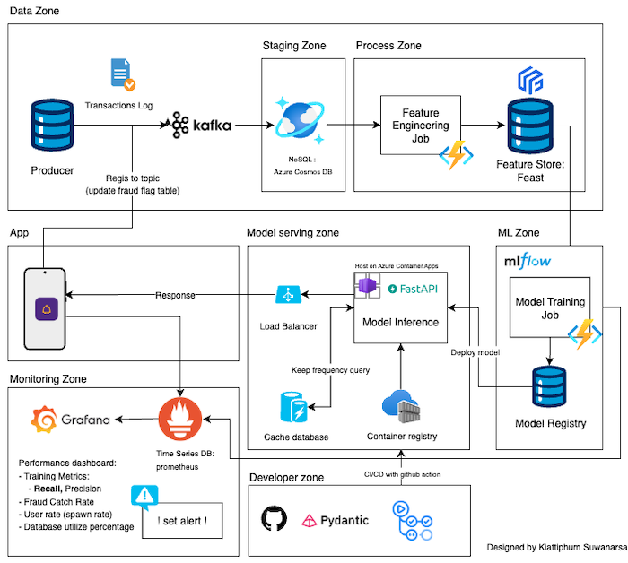

# ML Fraud Detection System

## Project Overview

This project builds a machine learning model and serves it via a REST API to detect fraudulent financial transactions. It includes:

- Data exploration and preprocessing
- A classification model for fraud detection
- A RESTful API service to provide fraud predictions
- A database for storing detected frauds
- A Kafka-ready architecture for real-time deployment

---

## 📦 Project Structure

The following is a simplified tree overview to give you an idea of the project layout:

```
.
├── notebook
│   ├── EDA_fraud_transaction.ipynb # Exploratory Data Analysis
│   └── Traning_fraud_transaction.ipynb # Model training and evaluation
├── data
│   └──  fraud_mock.csv # Sample transaction dataset
├── weight
│   └── fraud_detection_rf_model.joblib # Trained model weights
├── api
│   ├── controllers
│   │   └── frauds_controller.py
│   ├── dependencies
│   │   └── dependencies.py
│   ├── routes
│   │   ├── frauds_route.py
│   │   └── swagger_route.py
│   └── services
│       └── frauds_service.py
├── lib
│   ├── common
│   │   ├── constant.py
│   │   └── logger.py
│   ├── config
│   │   ├── secret.py
│   │   └── settings.py
│   ├── models
│   │   ├── api_model.py
│   │   └── transaction_record_model.py
│   └── repositories
│       └── fraud_repository.py
├── docker
│   └── Dockerfile
├── docker-compose.yml
├── poetry.lock
├── pyproject.toml
├── config.yaml
├── server.py
├── Makefile
└── README.md
```

### ! Add data before start runing !

- add : `fraud_mock.csv` into folder `data`
- add : `fraud_detection_rf_model.joblib` into folder `weight`

### ! Before Runing a notebook !

run

```bash
make init
source .venv/bin/activate
```

After that, select the env that crete in the nootbook.

---

## 🧪 EDA Instructions

To explore and analyze the dataset, open:<br> `notebook/EDA_fraud_transaction.ipynb`.
<br>Click **Run All** in Jupyter to execute all cells and view visual insights.

## Train the Model Instructions

To train the fraud detection model and export the weights:<br> `notebook/Traning_fraud_transaction.ipynb`
<br>Run the notebook to train the model and save the output to the `weight/` directory.

## 🚀 Start the API Service

Add `.env` file with this content:

```
DB_USER=scb
DB_PASSWORD=scb
```

We’ve simplified the launch process. Just run:

```bash
make start
```

To stop the service:

```bash
make down
```

Once running, you can access the interactive API docs at the root endpoint: <br>
`http://localhost:8080/`


Alternative documentation is available at: <br>
`http://localhost:8080/redoc`


## System Architecture



### Architecture Overview:

- Kafka: Ingests real-time transaction streams
- Fraud Detection API: Predicts fraud and stores results
- Database: Stores flagged fraudulent transactions
- Auditor Dashboard (optional): Enables review and status updates
- Scalability: Stateless architecture, suitable for Kubernetes
- Security: Recommend API key authentication and encrypted DB access

### Business Recommendations

- Monitor accounts with multiple fraud attempts
- Minimize false negatives to avoid missed frauds
- Assign a fraud risk score to each transaction
- Use predictions to flag accounts for proactive investigation
- Fix upstream issues: many transactions show logical inconsistencies (e.g., incorrect balances)
